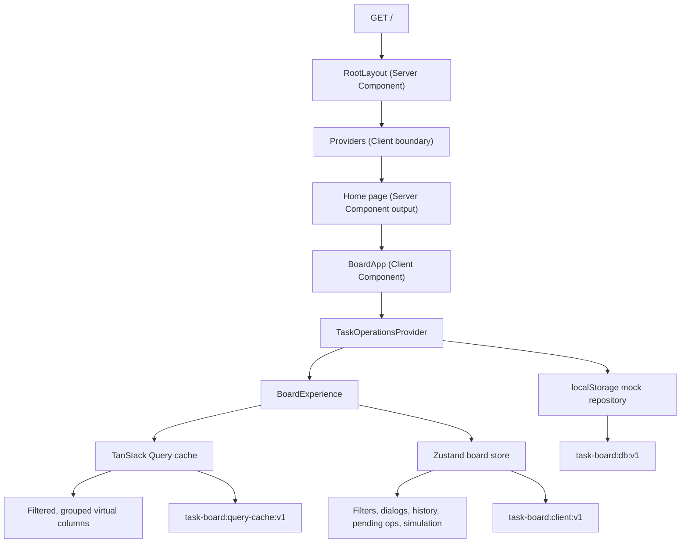
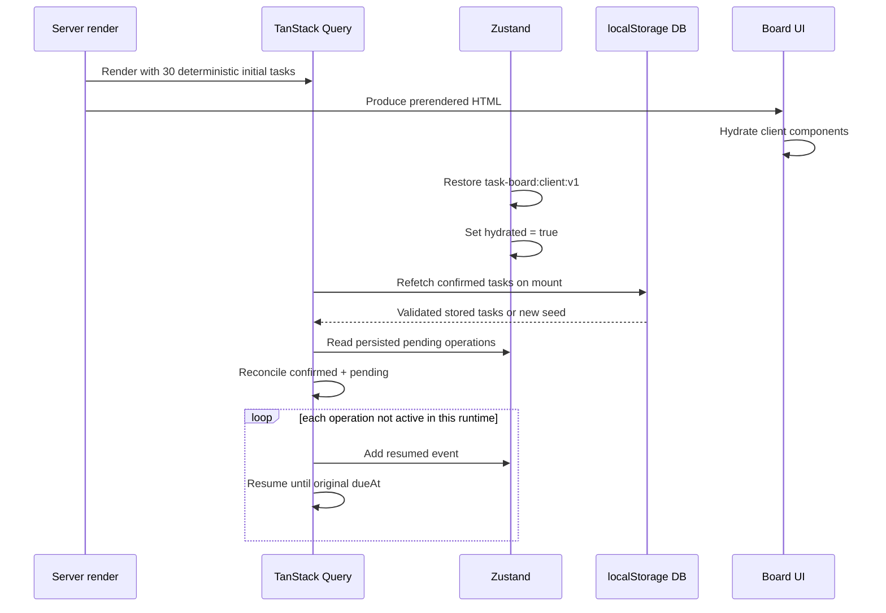
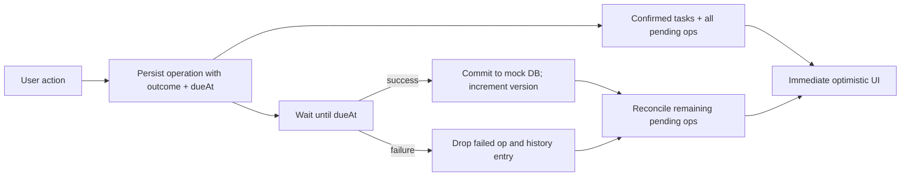

# Task Board: Complete Implementation Guide

This document explains how the application works from the first HTTP render through client hydration, local persistence, task mutations, filtering, collaboration simulation, conflict resolution, history, testing, and deployment. It describes the current working tree as inspected on July 22, 2026.

## 1. What the application is

The project is a single-route, browser-persisted collaborative task-board simulation. It has three Kanban columns—Todo, In progress, and Done—and supports:

- task creation and editing;
- pointer and keyboard drag-and-drop, plus a status select as a non-drag alternative;
- optimistic two-second mutations with forced or random failure and rollback;
- persisted pending mutations that resume after a reload;
- simulated remote edits and edit-conflict review;
- a 50-action local undo/redo history;
- quick filtering and an advanced nested query builder;
- readable, shareable URL filters and saved query favorites;
- independent list virtualization for 1,000-task stress data;
- system, light, and dark themes;
- keyboard shortcuts and accessible dialogs, sheets, controls, and drag announcements;
- unit, browser end-to-end, lint, type/build, Docker, and Dokploy support.

This is deliberately not a networked multi-user system. The “server,” network delay, remote users, and failures are deterministic or randomized browser-side simulations. Browser `localStorage` is the durable data store.

## 2. High-level architecture

The application divides responsibility among four main layers:

| Layer | Main implementation | Responsibility |
| --- | --- | --- |
| Next.js shell | `app/layout.tsx`, `app/page.tsx`, `app/error.tsx` | Route, document shell, metadata, fonts, provider boundary, route error fallback |
| Feature UI | `features/board/**`, `features/query-builder/**`, `features/developer-tools/**`, `features/keyboard-shortcuts/**` | Visible board, dialogs, filtering UI, DnD, virtual columns, developer controls, shortcuts |
| Client orchestration | `features/tasks/task-operations.tsx`, `stores/board-store.ts` | Query cache, mutations, optimistic projection, remote events, scheduling, global client state, persistence |
| Domain and persistence | `features/tasks/types.ts`, `repository.ts`, `seed.ts`, `selectors.ts`, `format.ts` | Runtime validation, domain types, mock database, deterministic data, pure filtering and formatting |



### Why there are both TanStack Query and Zustand

The two state systems intentionally own different kinds of state:

- TanStack Query owns the current visible task collection and mutation lifecycle. It represents “server state,” even though the source is a simulated local repository.
- Zustand owns UI and workflow state: filters, selected task, editing draft, conflict, undo/redo stacks, pending-operation descriptions, developer settings, and the event log.

The `pending` operation array lives in Zustand because it must persist across reloads. The visible task projection lives in TanStack Query because every optimistic change is expressed as confirmed tasks with the pending patches replayed on top.

## 3. Route and rendering lifecycle

### `app/layout.tsx`

`RootLayout` is a Server Component because it has no `"use client"` directive. It:

1. Imports global CSS.
2. Loads Geist Sans and Geist Mono through `next/font/google`.
3. exposes both fonts as CSS variables (`--font-geist-sans` and `--font-geist-mono`);
4. exports static Next.js metadata for the title and description;
5. renders the required root `<html>` and `<body>` elements;
6. applies `suppressHydrationWarning` to `<html>` because `next-themes` can change the class before hydration;
7. wraps only the route children in the client-side `Providers` component.

The provider is kept below `<html>` and `<body>`, preserving a small server-rendered document boundary while still making all route content interactive.

### `app/providers.tsx`

`Providers` is the first explicit Client Component. It owns browser APIs, React state, and context providers.

The provider nesting order is:

1. `ThemeProvider` from `next-themes`, using a class attribute, system preference by default, system change support, and transition suppression during a theme switch.
2. `PersistQueryClientProvider`, which supplies TanStack Query and persists its cache.
3. `TooltipProvider`, which supplies Base UI tooltip context.
4. Motion's `MotionConfig`, which honors the user's reduced-motion preference.
5. `LazyMotion` with `domAnimation`, which loads only the DOM animation feature set.
6. Route children.
7. A Sonner `Toaster`, positioned at the bottom-right with rich status colors.

The `QueryClient` and persister are each constructed in lazy `useState` initializers. This gives each mounted provider one stable instance rather than recreating clients on renders.

Default query behavior:

- data is fresh for 5 seconds (`staleTime`);
- unused query data may remain cached for 24 hours (`gcTime`);
- mutations do not retry automatically.

The `lazyBrowserStorage` object implements the `Storage` interface without touching `window` during server rendering. Every method checks `typeof window !== "undefined"`; reads become empty or `null` on the server and writes become no-ops. The query persister uses this adapter and the versioned key `task-board:query-cache:v1`. Its buster is `v1`, allowing future incompatible cache versions to be invalidated.

### `app/page.tsx`

The only public application route is `/`. `Home` remains a Server Component and renders `<BoardApp />`, a focused client boundary. The production build confirms `/` is statically prerendered.

### `app/error.tsx`

The route-segment error fallback is a Client Component, as required by Next.js 16.2. It receives:

- the thrown `error`, which it logs in an effect; and
- `unstable_retry`, the Next.js 16.2 retry function that re-fetches and re-renders the failed boundary's children.

It renders a centered error message, reassures the user that confirmed local data remains stored, and exposes a “Try again” button. It catches render-time errors below the root layout. It does not catch arbitrary asynchronous errors or exceptions inside event handlers; expected mutation failures are handled explicitly in the mutation callbacks instead.

## 4. Runtime component tree

`BoardApp` adds `TaskOperationsProvider`, then renders the private `BoardExperience` component.

```text
BoardApp
└── TaskOperationsProvider
    └── BoardExperience
        ├── AppHeader
        │   ├── Undo / redo controls
        │   ├── Keyboard shortcut control
        │   ├── Theme menu
        │   └── New-task control
        ├── DeveloperTools
        ├── main
        │   ├── BoardFilters
        │   │   └── QueryBuilder (when expanded)
        │   └── DndContext
        │       ├── TaskColumn: Todo
        │       ├── TaskColumn: In progress
        │       ├── TaskColumn: Done
        │       └── DragOverlay
        ├── AppFooter
        ├── CreateTaskDialog
        ├── TaskDetailsSheet
        │   └── conflict-resolution Dialog
        └── ShortcutsDialog
```

The dialogs and sheet are mounted once at the board root. Zustand booleans and `selectedTaskId` control their visibility, so any card or keyboard handler can open them without prop drilling.

## 5. Domain model and validation

### Task schema

`features/tasks/types.ts` defines the runtime Zod schemas and derives TypeScript types from them. This prevents the runtime and compile-time definitions from drifting.

| Field | Type | Meaning |
| --- | --- | --- |
| `id` | string | Stable task identity; deterministic seed ID or UUID for user-created tasks |
| `title` | non-empty string | Card and sheet title |
| `description` | non-empty string | Task details and quick-search source |
| `status` | `todo \| in-progress \| done` | Column membership |
| `priority` | `low \| medium \| high` | Priority badge and filter value |
| `assignee` | non-empty string | One of the configured people in normal UI flows |
| `tags` | string array | Card badges and queryable labels |
| `createdAt` | string | ISO timestamp assigned once |
| `updatedAt` | string | ISO timestamp updated optimistically and again at confirmation |
| `updatedBy` | string | Local acting user or simulated remote user |
| `version` | non-negative integer | Confirmed version counter; remote changes increment immediately |
| `position` | number | Sort key within a status column |

`TaskDraft` contains only the six editable fields: title, description, status, priority, assignee, and tags. System fields are never directly edited by the form.

`TaskPatch` permits partial changes to all fields except `id` and `createdAt`, although the current mutation API usually passes complete before/after snapshots rather than sparse patches.

### Shared constants

- `PEOPLE`: You, Alex Morgan, Priya Shah, Jordan Lee.
- `STATUSES`: Todo, In progress, Done in board order.
- `PRIORITIES`: Low, Medium, High.
- `STATUS_LABELS`: display labels for status values.

### Operation and collaboration types

`PendingOperation` is the durable description of one simulated request. It carries a UUID, task ID, operation kind, human-readable label, actor, full before/after snapshots, predetermined outcome, deadline, and history policy.

The outcome is chosen when the operation is queued—not after the two-second wait. Persisting both `outcome` and `dueAt` makes reload behavior deterministic.

`HistoryEntry` stores a separate ID plus the originating operation ID. Its nullable `before` and `after` values let creation be reversed by treating `after: null` as deletion.

`EditConflict` records the selected task, draft base version, complete incoming remote task, and only the editable fields changed by the remote event.

`SimulationEvent` is a compact audit row for queued, resumed, succeeded, failed, cancelled, or remote-updated activity. The current runtime emits all listed results except `cancelled`.

## 6. Deterministic seed data

`makeSeedTasks(count = 30)` creates reproducible data without external fixtures.

- Status cycles every task: todo, in-progress, done.
- Priority cycles high, medium, low on the same cadence.
- Assignee cycles across four people.
- Titles cycle across 10 templates; for datasets over 100 tasks, `#N` is appended to keep visible titles distinguishable.
- Descriptions cycle across five templates.
- Two tags are selected from a six-tag list.
- Dates are deterministic UTC values in July 2026.
- IDs are `task-1`, `task-2`, and so on.
- Every seed task starts at version 1.
- Position is `floor(index / 3) * 1000`, leaving large gaps for insertion.

Because status and priority advance together, the default 30 tasks happen to place high-priority tasks in Todo, medium-priority tasks in In progress, and low-priority tasks in Done. This is a property of the seed generator, not a board rule.

The 30- and 1,000-task developer datasets use the same generator, making tests and performance comparisons repeatable.

## 7. Persistent storage model

The browser contains three versioned application stores with different purposes:

| Key | Owner | Stored data |
| --- | --- | --- |
| `task-board:db:v1` | `features/tasks/repository.ts` | Confirmed task database as `{ version: 1, tasks }` |
| `task-board:query-cache:v1` | TanStack Query persister | Serialized query cache |
| `task-board:client:v1` | Zustand persist middleware | Filters, UI settings, draft/conflict, history, pending operations, event log |

The theme library also maintains its normal browser preference, but the application does not customize that storage key.

### Confirmed database behavior

`loadConfirmedTasks()` is safe on the server and in the browser:

1. If no browser storage exists, it returns 30 seed tasks without persisting them.
2. If the key is missing in the browser, it seeds 30 tasks and saves them.
3. If JSON parsing or Zod validation fails, it replaces the invalid data with a fresh 30-task dataset.
4. If validation succeeds, it returns the stored tasks.

This is recovery by reset, not partial migration. Any corrupt or schema-incompatible confirmed database is discarded.

### Zustand persistence boundary

The store intentionally excludes transient functions and `hydrated`; `onRehydrateStorage` sets `hydrated: true` after state restoration. It persists:

- quick and advanced filters;
- query-builder state and up to 20 favorites;
- selected task and developer panel state;
- acting/remote user and simulation settings;
- dataset size and next scheduled simulation time;
- draft, dirty/base metadata, and conflict;
- undo/redo stacks;
- pending operations;
- the 30 most recent events.

Create-dialog and shortcuts-dialog open state are not persisted.

### Reset behavior

Developer Tools “Reset” asks for confirmation, removes the persisted TanStack Query key, restores the Zustand store to its initial values while keeping it marked hydrated, and writes a fresh 30-task confirmed database.

The theme preference is not reset. The Zustand storage entry is subsequently rewritten from the reset state by the persist middleware.

## 8. Initial load and hydration

The task query uses key `['tasks']`, `queryFn: loadConfirmedTasks`, deterministic seed `initialData`, and `refetchOnMount: 'always'`.

The complete startup sequence is:



The deterministic initial data lets server and first client render agree, which avoids hydration mismatches. The stored database is applied after mount. `hydrated` prevents pending-operation recovery and automatic simulation scheduling before Zustand has restored the durable client state.

`runtimeActive` is a module-level `Set` of operation IDs. It prevents a single JavaScript runtime from starting the same restored operation more than once when effects re-run. It is intentionally not persisted; persisted operation IDs are the recovery source after a full reload.

## 9. Optimistic mutation engine

All local creates, edits, moves, reorders, conflict resolutions, undo actions, and redo actions pass through `execute()` in `TaskOperationsProvider`.

### Queueing a new operation

For a new operation, `execute()`:

1. reads the latest Zustand state imperatively;
2. generates an operation UUID;
3. resolves the task ID from `after.id` or `before.id`;
4. assigns the operation kind, label, and current acting user;
5. copies the complete `after` task and stamps an optimistic `updatedAt` and `updatedBy`;
6. consumes the selected failure mode;
7. sets `dueAt` to two seconds in the future;
8. appends the operation to persisted pending state;
9. records a history entry unless disabled;
10. records a `queued` event;
11. reloads confirmed tasks and replays every pending operation into the query cache;
12. starts the mutation.

Failure modes behave as follows:

- `random`: `Math.random() < 0.1` fails, producing a 10% failure rate;
- `success`: the next operation is guaranteed to succeed, then the mode resets to random;
- `failure`: the next operation is guaranteed to fail, then the mode resets to random.

### The visible optimistic projection

`reconcilePending(confirmed, operations)` reduces the pending list in array order. Each operation is applied using `applyOperationToTasks`:

- `after === null`: remove the task;
- task not present: append `after` as a new task;
- task present: replace its complete object with `after`.

Because complete snapshots are replayed, a later pending operation for the same task wins over earlier pending snapshots. Operations for different tasks compose independently.

### Simulated request and success

The mutation adds the operation ID to `runtimeActive`, waits until its stored deadline, and throws if the predetermined outcome is failure.

On success, `commitOperation()`:

1. reloads the latest confirmed database;
2. finds the current confirmed version of the task;
3. takes the operation's `after` snapshot;
4. stamps a new confirmation time and actor;
5. sets version to the current confirmed version plus one (or 1 for a new task);
6. inserts, replaces, or removes the task;
7. saves the confirmed database.

The success callback then removes the operation from `runtimeActive` and persisted pending state, replays any remaining pending operations over the returned confirmed tasks, updates the query cache, and logs a `success` event.

### Failure and rollback

On failure, the callback:

1. removes the runtime-active marker;
2. removes the pending operation;
3. removes its history entry if the failed operation originally recorded history;
4. reloads the unchanged confirmed database;
5. replays all other pending operations;
6. updates the query cache;
7. logs a `failed` event;
8. shows an error toast naming the action.

This rollback strategy is safer than restoring one captured array snapshot: an older failed operation cannot erase newer confirmed changes or unrelated optimistic operations.



### Reload recovery

After Zustand hydration, every persisted pending operation absent from `runtimeActive` gets a `resumed` event and is passed back to `execute()` as `existing`. Existing operations are not added to history or pending state a second time. `sleepUntil` waits only for the remaining duration; if the deadline passed during reload, it resolves immediately.

## 10. Task creation and editing

### Reusable `TaskForm`

The create dialog and details sheet share `TaskForm`. It is a controlled form: the parent owns the `TaskDraft`, while the form owns only validation errors.

On submit it requires trimmed title, description, and assignee. Errors are shown next to fields using `role="alert"`, and invalid text inputs get `aria-invalid`. Priority defaults to medium, status to todo, and tags are parsed from comma-separated input by trimming and dropping empty items.

The form uses `useId()` to create stable, instance-specific label/control IDs. Select controls use the typed constant lists. `showStatus` exists for reuse, although both current callers use the default and show status.

### Creating a task

`CreateTaskDialog` keeps its draft in local component state. On valid submission it:

1. assigns `crypto.randomUUID()`;
2. assigns current ISO creation/update timestamps;
3. assigns the selected acting user;
4. starts at version 0 so the first successful commit becomes version 1;
5. calculates a position before the current first task in the chosen status;
6. queues a `create` operation;
7. resets its local draft and closes immediately.

The position calculation is `min(1000, existing positions...) - 1000`. An empty column therefore receives position 0. A populated column receives a value at least 1,000 less than its lowest relevant position, which makes the optimistic card visible at the top even in a virtualized list.

### Opening and maintaining an edit draft

Clicking the textual portion of a card sets `selectedTaskId`. `TaskDetailsSheet` finds that ID in the current query tasks, derives the six-field draft, and stores it in Zustand with the complete task as `draftBaseTask`. The base snapshot supports later three-way reconciliation rather than tracking only a version number.

Every form edit calls `updateDraft`, merges the changed fields, and sets `draftDirty: true`. The draft is persisted, so an in-progress edit can survive a reload.

The initialization effect keys to the selected task ID, while the remote-update coordinator explicitly refreshes a clean open draft. Dirty local drafts remain protected and create a conflict against their stored base snapshot.

Saving without a conflict creates a complete `after` task by merging the draft over the current visible task and queues an `update`. The stored draft is then marked clean with an anticipated version of `before.version + 1` while confirmation continues asynchronously.

Closing the sheet clears selection, draft, and conflict.

## 11. Drag-and-drop, ordering, and the status fallback

`BoardExperience` configures dnd-kit with:

- a pointer sensor that requires 6 pixels of movement, reducing accidental drags;
- a keyboard sensor using `sortableKeyboardCoordinates`;
- `closestCenter` collision detection;
- an overlay card during drag;
- spoken announcements for pickup, movement, drop, and cancel.

Each task card uses `useSortable`. The drag-handle button receives dnd-kit's attributes and listeners, is marked `touch-none`, and has a task-specific accessible label. The whole original card becomes partially transparent during dragging.

Each column uses `useDroppable` with ID `column-<status>`, allowing a drop on empty column space as well as on a card.

### Position calculation

When moving or reordering a task, `moveTask`:

1. takes all tasks in the target status except the moving task;
2. sorts them by numeric position;
3. locates the card currently under the dragged card, or chooses the end for a column drop;
4. computes a midpoint between neighbors;
5. uses `before + 1000`, `after - 1000`, or 0 at an open boundary;
6. queues a normal update with a move or reorder label.

Fractional midpoints avoid renumbering the whole column. There is no compaction routine; JavaScript numbers provide enough practical midpoint precision for this demonstration, but indefinite repeated insertion between the same two positions would eventually merit normalization.

Ordering uses the full unfiltered task list. Therefore reordering while filters are active positions a task relative to hidden tasks as well as visible ones. This preserves a single canonical order but may make a filtered drop appear somewhere different after clearing filters.

The status select at the bottom of every card calls the same `moveTask` path, providing accessible status movement without drag gestures.

## 12. Column virtualization and rendering performance

Every `TaskColumn` owns a scroll container and a separate TanStack Virtual virtualizer.

Configuration:

- `count`: tasks in that status;
- estimated row height: 190 pixels;
- overscan: 8 rows above and below the viewport;
- stable key: task ID;
- initial rect: 400 by 600 pixels for a stable initial estimate;
- measured row height through `measureElement`;
- `useFlushSync: false` to avoid forced synchronous React flushes.

The inner container receives the virtualizer's total height. Only virtual items are rendered as absolutely positioned wrappers translated to `row.start`. Each real row is measured because content and responsive wrapping can change its height.

Column height is tied to the viewport (`100vh - 17.5rem`) with a 420-pixel minimum. On smaller screens columns are 88 viewport-width units in a horizontal snap scroller. At the large breakpoint they become a three-column grid.

Other render controls include:

- `TaskCard` wrapped in `React.memo`;
- memoized compiled query predicate;
- memoized filtered array;
- memoized grouped and sorted status arrays;
- memoized set of pending task IDs;
- stable callback functions from the operations provider;
- Zustand selector subscriptions in most feature components, limiting updates to selected slices.

`DeveloperTools` intentionally calls `useBoardStore()` without a selector because it displays many fields. It therefore re-renders for every store change, but it is one compact control surface rather than a repeated card.

The React lint plugin reports one known warning: `useVirtualizer()` returns functions that React Compiler cannot safely memoize. React skips compiler memoization for that component; TanStack Virtual still manages its own list updates.

## 13. Quick filters and board projection

`filterTasks()` is a pure function. It combines all enabled filters with logical AND:

- trimmed, case-insensitive search in title or description;
- exact assignee unless the filter is `all`;
- exact priority unless the filter is `all`;
- the compiled advanced predicate.

`BoardExperience` compiles the advanced tree only when it changes, then performs filtering in one memoized pass. A second memo groups results into the three statuses and sorts each group by position.

`BoardFilters` displays the result count and total task count. “Clear” resets search, assignee, priority, and the advanced tree.

Opening Advanced mode clears the three quick filters and disables their controls. Closing it re-enables quick controls but leaves the advanced query active. The count badge and Clear button make that state visible. Thus “advanced open” controls editing mode, while “advanced conditions exist” controls actual advanced filtering.

## 14. Advanced query representation

The query is a recursive tree:

```text
QueryGroup
├── kind: "group"
├── id
├── combinator: "and" | "or"
├── children: QueryNode[]
└── connectors?: ("and" | "or")[]

QueryCondition
├── kind: "condition"
├── id
├── field
├── operator
└── value
```

Supported fields are title, description, status, priority, assignee, and tags. Supported operators are equals, not-equals, contains, and not-contains.

`combinator` is both the group's default and the value used when “Set all connectors” is changed. Optional `connectors` allows each boundary between children to differ. If `connectors` is absent, the group combinator is repeated.

Zod validates legacy decoded query payloads, including a maximum of 50 children per group and 49 connectors. Factories use UUIDs for interactive nodes and stable `root` for the root group.

## 15. Query editing and evaluation

### Immutable tree operations

- `updateQueryNode` recursively visits the tree and replaces the matching node.
- `appendQueryNode` adds a child and maintains the connector array.
- `removeQueryNode` removes a direct child from each visited group and removes the connector adjacent to it. If all remaining connectors equal the group's combinator, it removes the explicit connector array as a normalization.
- Removing the root returns a fresh empty query.
- `countConditions` recursively counts leaf conditions.
- `describeQuery` produces the readable summary shown above the editor.

### Predicate compilation

`compileTaskQuery` recursively creates one predicate function.

For a condition:

1. trim and lower-case the query value;
2. return true for an empty query value, so an unfinished rule does not hide all tasks;
3. normalize the task field to an array of lower-case strings;
4. test exact equality or substring containment against any value;
5. negate for the two negative operators.

For a group, child predicates are compiled once. Empty groups always match.

AND has higher precedence than OR within a group. The implementation splits the child predicate sequence into OR-separated clauses, then requires every predicate within at least one clause. Consequently:

```text
A OR B AND C
```

is evaluated as:

```text
A OR (B AND C)
```

Nested groups provide explicit parentheses.

For array fields such as tags, equals means any individual tag exactly equals the query value, and contains means any individual tag contains it. It does not join the array before matching.

### Query-builder UI

`QueryBuilder` renders itself recursively through `QueryGroupEditor`:

- groups can set all connectors, add a rule, add a nested group, or be removed;
- every connector after the first rule can be changed independently;
- condition fields and operators are selects;
- priority, status, and assignee use constrained value selects;
- text fields and tags use free text;
- changing a field also selects a sensible default value;
- the root can be cleared without removing the editor.

Favorites are named, capped to 60 characters, assigned UUIDs, and capped to the last 20 saved values. Applying a favorite replaces the active advanced query and opens the builder. Deleting a favorite removes it immediately from persisted client state.

Favorites currently store the query object by reference at save time. Because all query editing operations return new immutable objects, later edits do not mutate a saved favorite.

## 16. Shareable URL format and synchronization

The preferred URL format is readable:

```text
?rule1=priority.equals.high&rule2=assignee.equals.You&logic=1-and-2
```

Quick filters use:

```text
?search=authentication&assignee=You&priority=high
```

### Writing a query

`writeQueryParams` first removes all existing `ruleN`, `logic`, and legacy `q` parameters. It walks the query depth-first, writes each condition as `field.operator.value`, and generates a numeric logic expression. Nested groups become parentheses. The outermost parentheses are omitted.

Values may contain periods: parsing assigns the first segment to field, the second to operator, and joins all remaining segments back into the value.

### Reading a query

`readQueryParams`:

1. finds every `ruleN` entry;
2. validates field and operator;
3. creates stable URL-derived condition IDs;
4. uses `logic`, or an AND sequence in rule-number order if logic is absent;
5. tokenizes numbers, `and`, `or`, and parentheses;
6. parses with recursive-descent functions where primary/parentheses bind first, then AND, then OR;
7. rejects malformed or partially consumed expressions;
8. normalizes the result to a root group.

The code also retains `encodeQuery` and `decodeQuery` for backward compatibility with versioned JSON or base64url `q` payloads. New writes always upgrade to readable parameters and delete `q`.

### Hydration-safe two-way synchronization

`useQueryUrlSync` waits for Zustand hydration, then performs an inbound read before allowing outbound synchronization:

- readable rules win over legacy `q`;
- an invalid legacy `q` is removed;
- initial assignee and priority values are accepted only if present in configured constants;
- quick search is accepted as text;
- a microtask flips `ready` only after the URL-derived Zustand updates can settle.

Once ready, changes update the current address with `window.history.replaceState`. This does not navigate or add a history entry for each keystroke.

A `popstate` listener restores filters for browser back/forward navigation. The listener clears advanced filtering if the destination has no valid query.

The hook intentionally uses `window.location` rather than Next.js server `searchParams`: filtering is entirely client-side over already-loaded local tasks, and the route remains statically prerenderable.

## 17. Undo and redo

Normal local operations add a history entry before confirmation. The past stack is capped to its latest 50 entries, and every new local history entry clears the future stack.

Undo:

1. `takeUndo()` removes the newest past entry and appends it to future;
2. the operations provider looks up the task's current visible state;
3. it queues the entry's original `before` snapshot as a forced inverse operation;
4. the inverse is labeled `Undo: <original label>` and does not create another history entry.

Redo mirrors this process: it removes the latest future entry, returns it to past, and queues its original `after` snapshot.

Because undo uses the current task as `before` and the historical snapshot as `after`, the historical fields deliberately win over intervening remote edits. Undoing creation uses `after: null`, which removes the task. Redo then restores the recorded created task.

The header reads the latest labels to disable or describe its buttons. The shortcuts dialog also renders the exact next undo/redo descriptions.

If an original optimistic operation fails, `removeHistory(operation.id)` removes the corresponding entry from `past`. Remote events never enter history.

Implementation nuance: undo/redo moves the stack entry before its own simulated request resolves. An undo or redo request is configured with `recordHistory: false`; if that inverse request fails, the stack movement is not automatically reversed. The visible task data rolls back correctly, but the history cursor may no longer represent that failed attempt. This is an edge case to address if history semantics must be transactional.

## 18. Remote update simulation

Developer Tools is the only source of simulated remote changes. Auto simulation starts disabled.

`triggerRemote(source, forcedTaskId?)`:

1. loads confirmed tasks, not the optimistic query projection;
2. resolves a forced, configured, or random task;
3. chooses a remote actor different from the current acting user;
4. chooses the configured field or a random editable field;
5. creates a new confirmed task with incremented version, current timestamp, and remote actor;
6. applies a deterministic field-specific change;
7. writes the confirmed database immediately;
8. reconciles the new confirmed state with local pending operations;
9. detects an active edit conflict when applicable;
10. logs an event and shows a toast with a View action.

Field mutations are deliberately obvious:

- title appends `· updated` without repeatedly duplicating the suffix;
- description appends an actor-specific note;
- status advances through the three statuses;
- priority advances through the three priorities;
- assignee becomes a random remote person;
- tags add `collaboration` without duplication.

### Automatic scheduling

When enabled after hydration, auto simulation uses the persisted `nextSimulationAt` if it is still in the future. Otherwise it schedules 10,000 to 15,000 milliseconds ahead. After firing, it writes the next randomized deadline. Developer Tools updates a local clock once per second only while auto simulation is enabled so it can display the countdown.

Disabling or changing auto simulation clears the timer through the effect cleanup. The persisted deadline allows the schedule to survive reloads.

### Developer controls

The panel exposes:

- current acting user;
- fixed or random remote user;
- fixed or random changed field;
- fixed or random target task (first 100 tasks are offered to bound menu size);
- manual remote update;
- forced conflict for a dirty selected task;
- deterministic remote viewing/editing presence and release controls;
- automatic 10–15 second updates;
- random, next-success, or next-failure network outcome;
- forced offline/reconnected network state;
- 30/1,000 dataset toggle;
- event-log clear;
- complete local board reset;
- current pending count and latest event summary.

Changing datasets pauses auto simulation, clears selection, updates the query cache, and displays a success toast. It does not call `resetClient`, so filters, history, events, and most developer settings remain unless the separate Reset action is used.

## 19. Conflict detection and resolution

A conflict is created only when a remote update affects the selected task while:

- the edit draft is dirty; and
- a complete draft base task exists.

`changedDraftFields` compares the six editable fields with JSON serialization, which gives value comparison for the tags array rather than reference comparison.

The sheet keeps the local draft, shows a warning, and changes the submit label to “Review and save.” Saving then opens a comparison dialog. Only fields changed remotely are shown as choices; untouched fields implicitly keep the local draft value.

Resolution paths:

- **Take theirs:** replace the draft with the complete incoming task's editable fields, update the base snapshot, mark clean, clear the conflict, and close the dialog. No mutation is needed because the remote version is already confirmed.
- **Keep mine:** merge the complete local draft over the incoming confirmed task and queue one `resolve` mutation.
- **Merge manually:** use “theirs” for fields explicitly selected that way and local values for all others. Description conflicts start with the deterministic block reconciliation result in an editable textarea, then queue one `resolve` mutation.

Keep-mine and reviewed resolution use the incoming remote task as `before`, so the new optimistic operation builds on the newest known confirmed version. The resolution is one undoable history action.

### Presence, locks, and CRDT-like description reconciliation

Opening the task sheet publishes local viewing presence, and the first draft change promotes it to editing. Cards show accessible avatar groups for each present user. A remote `editing` entry locks the drag handle, status selector, and edit form until that presence is released. Developer Tools provides deterministic viewing/editing/release controls; simulated remote updates also publish viewing presence.

Description merging is a compact sequence CRDT-like strategy over sentence blocks. Blocks observed in the base but deleted by either side use observed-remove semantics. Concurrent additions carry actor identity and source position, then sort deterministically and deduplicate. Swapping arrival order while preserving actor identity therefore produces the same result. Because task descriptions are free-form text rather than a production replicated document, the user can edit the proposed merged result before commit.

### Reconciliation limits

Pending operations carry complete task snapshots. A local optimistic snapshot replayed after a remote confirmation may visually cover the remote change until the local operation resolves. A successful local commit also writes its complete snapshot, so fields outside the user's intended edit can overwrite remote changes unless the conflict workflow caught and resolved them.

When a selected draft is clean, a remote update refreshes the form and its base snapshot immediately. When it is dirty, the original base remains fixed until the user resolves or discards the conflict.

### Offline and reconnect behavior

`NetworkStatus` combines browser `online`/`offline` events with the deterministic Developer Tools override. Offline operations still enter the optimistic and persisted pending arrays, but they do not begin their simulated request. On reconnect, confirmed tasks are reloaded, every pending patch is replayed, offline deadlines are reset to the normal two-second latency, and inactive operations start exactly once. An operation that loses connectivity while already waiting pauses until reconnection and then observes the same latency before committing. The banner and toasts explain queued and resumed work.

## 20. Header, footer, themes, motion, and notifications

The sticky header contains:

- product mark and title;
- tooltip-wrapped undo and redo buttons;
- shortcuts button with `?` hint;
- theme dropdown for light, dark, or system;
- create button with `N` hint.

The footer contains the owner name and mail, GitHub, and LinkedIn links. External profile links open in a new tab with `rel="noreferrer"`; brand icons are marked decorative where the text already supplies the accessible name.

Theme colors are defined as OKLCH CSS variables in `app/globals.css`, with separate `:root` and `.dark` values. Tailwind's inline theme maps semantic utility names such as `bg-background`, `text-muted-foreground`, and `border-border` onto those variables. The stylesheet also defines radii, font mappings, selection color, a 320-pixel minimum body width, and pointer cursors for enabled button-like controls.

Motion is used only for the drag overlay's scale/opacity entrance. `MotionConfig reducedMotion="user"` delegates to the user's operating-system preference.

Sonner reports successful dataset changes, mutation rollback, and remote activity. The remote toast includes a View action that selects the affected task.

## 21. Keyboard and accessibility implementation

The global shortcut hook installs one `keydown` listener and removes it on cleanup. It ignores:

- already prevented events;
- key repeats;
- input, textarea, select, contenteditable, textbox, or combobox targets.

Supported shortcuts:

| Shortcut | Action |
| --- | --- |
| `?` | Open shortcut reference |
| `/` | Focus the quick-search input |
| `N` | Open create dialog |
| `D` | Toggle Developer Tools |
| `Ctrl/Cmd + Z` | Undo |
| `Ctrl/Cmd + Shift + Z` | Redo |

The shortcut dialog detects Apple platforms after mount and renders `⌘` or `Ctrl` accordingly. Its history rows are dynamic and show the exact next actions.

Additional accessibility measures:

- semantic page landmarks: header, main, footer, and labeled footer navigation;
- real headings for app, columns, cards, dialog/sheet titles, and groups;
- Base UI-backed dialog, menu, select, sheet, switch, and tooltip primitives;
- focus-restoring modal primitives and escape-to-close behavior;
- visible labels and stable IDs in forms;
- inline validation alerts and `aria-invalid`;
- `aria-busy` on pending cards and a labeled saving spinner;
- task-specific labels for drag handles and status selects;
- dnd-kit screen-reader announcements;
- keyboard DnD through Tab, Space/Enter, arrows, and Escape;
- non-drag status selection;
- user reduced-motion preference;
- dark-mode-aware semantic colors.

## 22. UI primitive layer

`components.json` configures shadcn's Base Nova style, React Server Component compatibility, TypeScript, Tailwind CSS variables, neutral base color, Lucide icons, and `@/` aliases.

`lib/utils.ts` exposes `cn()`, which first conditionally composes classes with `clsx`, then resolves conflicting Tailwind utilities with `tailwind-merge`.

The UI directory is a project-owned component layer rather than calls to shadcn at runtime:

| File | Implementation and current role |
| --- | --- |
| `alert.tsx` | CVA-styled semantic alert container, title, description, and action; used for edit conflicts |
| `avatar.tsx` | Base UI avatar image/fallback, badge, and group helpers; available but unused by the board |
| `badge.tsx` | CVA badge variants with Base UI render composition; used for counts, tags, priority, version, and shortcuts |
| `button.tsx` | Base UI button plus CVA size/variant system; the common action primitive |
| `card.tsx` | Styled structural card sections; task cards use Card and CardContent |
| `command.tsx` | `cmdk` command palette wrappers, optional dialog form, items, groups, and shortcuts; currently unused |
| `dialog.tsx` | Base UI modal root, portal, backdrop, close control, content, header/footer/title/description; used for create, conflict, and shortcuts |
| `dropdown-menu.tsx` | Base UI menu wrappers including nested, checkbox, and radio items; theme menu uses the basic subset |
| `input-group.tsx` | Composite input/textarea addons and buttons; available but unused |
| `input.tsx` | Styled Base UI/native input wrapper; used by forms, search, and favorite name |
| `label.tsx` | Styled native label; used by `TaskForm` |
| `popover.tsx` | Base UI popover wrappers; available but unused |
| `scroll-area.tsx` | Base UI custom scroll area and scrollbar; available but task columns use native overflow for virtualization |
| `select.tsx` | Base UI select root, trigger, popup, items, labels, separators, and scroll buttons; used throughout filters, forms, cards, queries, and Developer Tools |
| `separator.tsx` | Base UI separator; available but unused |
| `sheet.tsx` | Dialog-based edge sheet with side variants and close control; used for task details |
| `skeleton.tsx` | Animated placeholder block; used by `LoadingBoard` |
| `sonner.tsx` | Theme-aware Sonner toaster with Lucide status icons; mounted globally |
| `switch.tsx` | Base UI switch; used for automatic simulation |
| `textarea.tsx` | Styled native textarea; used for task description |
| `tooltip.tsx` | Base UI provider, root, trigger, and portal content with arrow; used in the header |

Unused primitives are harmless scaffold capacity; they still contribute code only if imported into the client module graph.

## 23. Loading and error states

The query uses synchronous `initialData`, so normal startup usually has tasks immediately. `LoadingBoard` remains as a defensive query-loading state and shows three columns with heading and card skeletons.

Expected simulated request errors never escape to the route error boundary. They are modeled as mutation outcomes, reconciled, logged, and shown via toast.

Unexpected render errors use `app/error.tsx`. Confirmed data remains in the database key, and the Next.js `unstable_retry` action attempts to render the route segment again.

Repository corruption is handled silently by validation failure and reseeding. There is no UI to recover invalid stored data selectively.

## 24. Automated tests

### Unit tests

Vitest runs in jsdom, loads `@testing-library/jest-dom`, resolves TypeScript aliases, and includes `features/**/*.test.{ts,tsx}`.

`features/tasks/task-logic.test.ts` verifies:

- 1,000 deterministic, schema-valid, uniquely identified seed tasks;
- combined search, assignee, and priority filters;
- replay of multiple optimistic operations over confirmed data;
- inverse removal of an optimistic creation.

`features/query-builder/query-engine.test.ts` verifies:

- nested AND/OR evaluation over 1,000 tasks;
- versioned base64url and JSON legacy round trips;
- immutable append, edit, and remove operations;
- readable query parameter generation and parse equivalence;
- mixed per-rule connectors with AND precedence.

Current unit result: 2 files, 9 tests, all passing.

### End-to-end tests

Playwright runs Chromium against a reused or automatically started `npm run dev` server at port 3000. Traces are retained on failure.

`tests/e2e/board.spec.ts` verifies:

1. shortcut help opens from the button and `?`;
2. reload produces no hydration mismatch console errors;
3. task creation appears optimistically and exposes the pending counter before confirmation;
4. a pointer drag crosses columns without the overlay animating back to its old column;
5. Developer Tools can trigger remote activity;
6. an advanced mixed-connector query updates readable URL parameters, filters results, saves a favorite, and survives reload;
7. normal search synchronizes to the URL and survives reload.

Current browser result: 7 tests, all passing.

### Gaps in automated coverage

The current suite does not directly exercise:

- keyboard drag ordering and same-column pointer reordering;
- forced failure rollback;
- pending-operation resume across reload;
- undo/redo success and failure;
- conflict field selection paths;
- automatic simulation timing;
- 1,000-task mounted-node bounds;
- theme behavior;
- the route error fallback.

The pure reconciliation and query logic have strong focused tests, while several multi-step interaction edges remain candidates for browser tests.

## 25. Build, lint, and TypeScript configuration

### Package scripts

```text
npm run dev       Next.js development server
npm run build     Optimized Next.js production build and TypeScript validation
npm run start     Start the production Next.js server
npm run lint      ESLint
npm test          Vitest once
npm run test:watch
npm run test:e2e  Playwright Chromium suite
```

The package requires Node 22.x. TypeScript is strict, emits no files, uses bundler module resolution, React JSX, incremental checking, DOM/ESNext libraries, and the `@/* -> ./*` path alias.

ESLint composes Next.js core-web-vitals and TypeScript rules. Generated Next/build outputs are globally ignored.

Verified current results:

- unit tests: pass, 9/9;
- end-to-end tests: pass, 7/7;
- lint: exits successfully with one known TanStack Virtual/React Compiler warning;
- production build: pass;
- route `/`: statically prerendered.

## 26. Deployment implementation

`next.config.ts` uses `output: "standalone"`. Next.js therefore emits a traced minimal Node server and only required runtime dependencies under `.next/standalone`.

### Dockerfile

The multi-stage image uses Node 22 Alpine:

1. `base` disables telemetry and sets `/app`.
2. `dependencies` installs `libc6-compat`, copies lock files, and runs `npm ci`.
3. `builder` copies dependencies and source, then runs the production build.
4. `runner` creates an unprivileged `nextjs` user and group.
5. Only `public`, `.next/standalone`, and `.next/static` are copied into the runtime image.
6. Environment config binds to `0.0.0.0:3000` in production.
7. The container runs as the non-root user.
8. A `wget` health check probes `/` every 30 seconds after a 20-second startup grace period.
9. `node server.js` starts the traced standalone server.

`.dockerignore` removes Git metadata, dependencies, builds, secrets, test artifacts, output, and local OS files from the build context.

### Nixpacks fallback

`nixpacks.toml` explicitly selects Node 22, runs `npm ci`, builds with `npm run build`, and starts with `npm run start`. It exists because Dokploy may default to Nixpacks if Dockerfile mode is not selected.

No persistent server volume is required or useful: all application state is per-browser `localStorage`. Deploying a new container does not move one browser's data to another browser and cannot provide shared multi-user collaboration.

## 27. Dependency responsibilities

| Dependency | Purpose |
| --- | --- |
| Next.js 16.2.11 | App Router, server/client component composition, fonts, metadata, error boundary, build/runtime |
| React/React DOM 19.2.4 | Component and hook runtime |
| TanStack Query + persist packages | Task query cache, mutations, cache persistence |
| Zustand | Durable global client/workflow state |
| Zod | Task and query runtime validation |
| dnd-kit | Pointer/keyboard drag-and-drop and sortable behavior |
| TanStack Virtual | Per-column row virtualization |
| Base UI | Accessible headless primitives behind the shadcn layer |
| shadcn + CVA + clsx + tailwind-merge | UI scaffolding, variants, and class composition |
| Tailwind CSS 4 + animation packages | Styling and theme utilities |
| next-themes | system/light/dark class management |
| Motion | reduced-motion-aware drag overlay animation |
| Sonner | toast notifications |
| Lucide React + React Icons | general and brand icons |
| date-fns | Installed but not imported; dates currently use native `Intl.DateTimeFormat` |
| cmdk | Used by the available but currently unmounted command primitive |
| Vitest + Testing Library + jsdom | unit-test environment |
| Playwright | Chromium end-to-end tests |

## 28. File-by-file responsibility map

### Route and styling

| File | Responsibility |
| --- | --- |
| `app/layout.tsx` | Root document, metadata, Geist fonts, global provider insertion |
| `app/page.tsx` | `/` route that renders the board client boundary |
| `app/providers.tsx` | Theme, query persistence, tooltip, motion, and toast providers |
| `app/error.tsx` | Route-level unexpected render error UI and retry |
| `app/globals.css` | Tailwind imports, semantic theme tokens, dark theme, base styles |
| `app/favicon.ico` | Browser/site icon through App Router metadata convention |

### Board feature

| File | Responsibility |
| --- | --- |
| `features/board/board-app.tsx` | Feature composition, memoized projection, DnD context, move ordering, header/footer/loading UI |
| `features/board/board-filters.tsx` | Quick filters, advanced-mode toggle, counts, clear action |
| `features/board/create-task-dialog.tsx` | New-task local draft, metadata/position creation, optimistic create |
| `features/board/task-card.tsx` | Memoized sortable card, task summary, pending state, status fallback |
| `features/board/task-column.tsx` | Droppable status container and virtual row layout |
| `features/board/task-details-sheet.tsx` | Persisted edit draft, task metadata, conflict comparison and resolution |
| `features/board/task-form.tsx` | Shared controlled task form and required-field validation |

### Task/domain feature

| File | Responsibility |
| --- | --- |
| `features/tasks/types.ts` | Zod schemas, derived domain types, operation/history/conflict/event types, constants |
| `features/tasks/seed.ts` | Deterministic 30/1,000-task data generator |
| `features/tasks/repository.ts` | Confirmed browser database, validation/recovery, operation commit/replay, deadline wait |
| `features/tasks/selectors.ts` | Pure quick/advanced task filtering |
| `features/tasks/format.ts` | UTC date formatting through `Intl.DateTimeFormat` |
| `features/tasks/task-operations.tsx` | Query/provider API, optimistic lifecycle, rollback, resume, history commands, remote simulation, reset |

### Query feature

| File | Responsibility |
| --- | --- |
| `features/query-builder/types.ts` | Query tree types, schemas, favorite type, node factories |
| `features/query-builder/query-engine.ts` | Immutable editing, compilation, precedence, descriptions, legacy/readable URL codecs |
| `features/query-builder/query-builder.tsx` | Recursive query editor and favorites UI |
| `features/query-builder/use-query-url-sync.ts` | Hydration-ordered inbound/outbound URL synchronization and popstate handling |

### Supporting features and state

| File | Responsibility |
| --- | --- |
| `stores/board-store.ts` | Zustand state/actions and selective durable persistence |
| `features/developer-tools/developer-tools.tsx` | Simulation, failure, dataset, countdown, log, and reset controls |
| `features/keyboard-shortcuts/use-keyboard-shortcuts.ts` | Global shortcut event handling and editable-target guard |
| `features/keyboard-shortcuts/shortcuts-dialog.tsx` | Platform-aware shortcut reference and live history labels |
| `lib/utils.ts` | Tailwind-aware class-name composition |

### Tests and configuration

| File | Responsibility |
| --- | --- |
| `features/tasks/task-logic.test.ts` | Domain, seed, filter, and reconciliation unit tests |
| `features/query-builder/query-engine.test.ts` | Query evaluation, editing, precedence, and URL unit tests |
| `tests/e2e/board.spec.ts` | Core user-flow browser tests |
| `vitest.config.mts` | jsdom unit runner, React/alias plugins, coverage reporters |
| `vitest.setup.ts` | jest-dom matcher registration |
| `playwright.config.ts` | Chromium project, local dev server, base URL, failure traces |
| `eslint.config.mjs` | Next core-web-vitals and TypeScript lint configuration |
| `tsconfig.json` | Strict TypeScript and `@/` alias configuration |
| `postcss.config.mjs` | Tailwind CSS 4 PostCSS plugin |
| `next.config.ts` | Standalone production output |
| `components.json` | shadcn style, aliases, CSS, and icon configuration |
| `package.json` / `package-lock.json` | Node constraint, scripts, exact dependency graph |

### Deployment and project documentation

| File | Responsibility |
| --- | --- |
| `Dockerfile` | Reproducible non-root standalone production image |
| `.dockerignore` | Minimal, secret-safe Docker build context |
| `nixpacks.toml` | Node 22 Dokploy/Nixpacks fallback |
| `README.md` | Operator-facing overview, run/deploy instructions, feature notes, scope decisions |
| `Optional-React-Assignment.md` | Original assignment and acceptance requirements |
| `AGENTS.md` | Repository-specific contributor instruction to consult bundled Next.js docs |
| `CLAUDE.md` | Minimal repository marker with no application behavior |
| `public/*.svg` | Default static starter assets; not referenced by the current board UI |

Generated/local files such as `.next/**`, `next-env.d.ts`, and `tsconfig.tsbuildinfo` support framework execution and type checking; they do not contain authored application behavior.

## 29. Important design strengths

1. **Confirmed state is separated from optimistic projection.** Rollback always rebuilds from confirmed data plus remaining operations instead of restoring stale snapshots.
2. **Pending operations are durable.** Outcome and deadline persistence prevents reload from silently converting, duplicating, or extending an operation.
3. **The URL is a first-class filter state.** Readable rules, legacy compatibility, validation, and hydration ordering make links shareable without dynamic server rendering.
4. **Performance work is structural.** Virtualization, stable IDs, memoized projections, and bounded menus/logs address the 1,000-task path directly.
5. **Accessibility has alternative paths.** Keyboard DnD, status selects, shortcut guards, live labels, semantic primitives, announcements, and reduced motion are implemented rather than merely documented.
6. **Developer controls make race paths reproducible.** Forced success/failure, targeted remote fields/tasks, presence/locks, offline mode, conflict trigger, and deterministic datasets make behavior inspectable.
7. **Runtime schemas protect persisted data.** Corrupt database and legacy query payloads fail closed into known states.

## 30. Known boundaries and future-hardening opportunities

These are not hidden failures; they define the line between the current simulation and a production collaborative system.

- There is no backend, authentication, authorization, server database, cross-device sync, or websocket; presence is simulated within one browser.
- Full task snapshots can overwrite unrelated remote fields; production collaboration should use server-side version checks and field-level patches or a CRDT/OT model where appropriate.
- Failed undo/redo requests do not restore the history cursor movement.
- Runtime storage writes do not handle quota or browser-denied storage errors.
- Database corruption recovery replaces all tasks instead of migrating or offering export/recovery.
- Position values are never normalized after repeated midpoint insertion.
- The first 100 tasks only are selectable as explicit Developer Tools targets in the stress dataset.
- History entries store complete task snapshots; 50 entries are bounded but still larger than patch-only history.
- Query readable-rule parsing is deliberately permissive and separate from the stricter legacy Zod payload validation.
- No delete UI exists, although the operation/repository layer supports removal for undoing creation.
- No service worker means a cold load without cached application assets still requires a network, although already-loaded task changes queue and reconnect correctly.

## 31. Practical tracing recipes

To follow a task creation in code:

```text
AppHeader or N shortcut
→ board-store.setCreateOpen(true)
→ CreateTaskDialog
→ TaskForm validation
→ CreateTaskDialog.create()
→ TaskOperationsProvider.execute()
→ pending/history/event in Zustand
→ reconcilePending() into TanStack Query
→ immediate TaskCard with aria-busy
→ mutation wait
→ commitOperation() or rollback
→ final query reconciliation and toast/event
```

To follow an advanced filter:

```text
QueryBuilder control
→ immutable query-engine update
→ board-store.advancedQuery
→ useQueryUrlSync writes ruleN + logic
→ BoardExperience recompiles predicate
→ filterTasks combines quick + advanced tests
→ memoized grouping/sorting
→ TaskColumn virtualizers receive new arrays
```

To follow a simulated conflict:

```text
Dirty TaskDetailsSheet draft
→ DeveloperTools triggerRemote("conflict")
→ confirmed DB remote update + version increment
→ query reconciliation
→ EditConflict stored with changed fields
→ sheet warning
→ save opens comparison dialog
→ take theirs OR resolve with mine/reviewed fields
→ optional optimistic resolve operation and history entry
```

## 32. Verification snapshot

The implementation described here was checked against:

- the complete application-specific source tree;
- all reusable UI primitive entry points;
- the repository's Next.js 16.2 bundled guides for App Router structure, server/client boundaries, and error handling;
- the live local page and its accessibility tree;
- `npm test`;
- `npm run test:e2e`;
- `npm run lint`;
- `npm run build`.

At the time of verification, every test and the production build passed. Lint completed with the single documented `useVirtualizer()` React Compiler compatibility warning and no errors.
