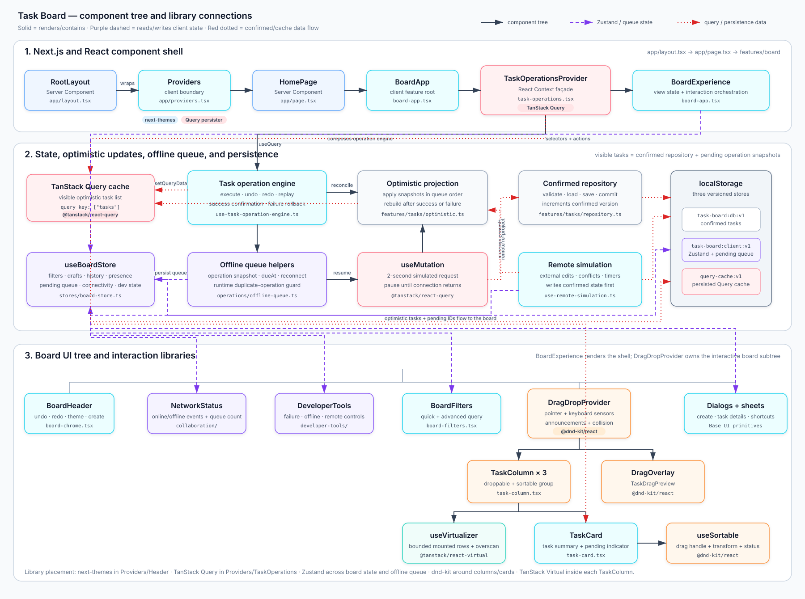

# Component tree and library connections



## Reading the diagram

- Solid arrows show React rendering or feature composition.
- Purple dashed arrows show Zustand state reads, actions, and the persisted
  pending-operation queue.
- Red dotted arrows show confirmed task data, optimistic query-cache
  projections, and browser persistence.

The most important runtime relationship is:

```text
visible tasks = confirmed repository tasks + persisted pending operations
```

TanStack Query owns the visible list, Zustand owns client workflow state and
the offline queue, and the repository owns confirmed task storage. Dnd-kit
wraps the board interaction subtree, while each `TaskColumn` uses TanStack
Virtual to limit mounted task rows.
