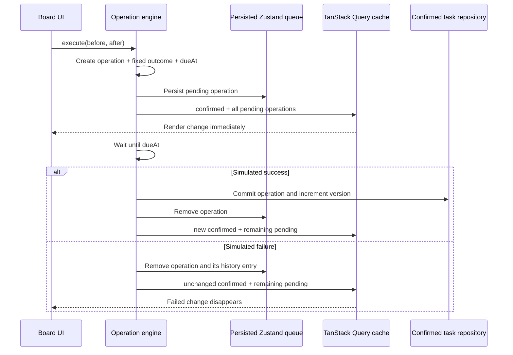
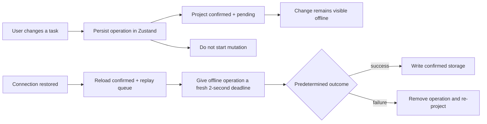

# Offline and optimistic operations

This guide explains how a task change becomes visible immediately, survives an
offline period or reload, and is later confirmed or rolled back.

## The mental model

The board does not treat the rendered task array as a second database. The
visible list is always rebuilt from two durable inputs:

```text
visible tasks = confirmed tasks + pending operation snapshots
```

That rule is implemented by
`features/tasks/optimistic.ts/reconcilePending()`. It is the central invariant
for both optimistic updates and rollback.

## State ownership

| State | Owner | Browser key | Purpose |
| --- | --- | --- | --- |
| Confirmed tasks | Task repository | `task-board:db:v1` | Mock server/database state |
| Pending operations | Zustand board store | `task-board:client:v1` | Durable offline and in-flight queue |
| Visible tasks | TanStack Query | `task-board:query-cache:v1` | Render-ready optimistic projection |
| Undo/redo history | Zustand board store | `task-board:client:v1` | User command history, capped at 50 |

Keeping these roles separate avoids a common ambiguity: a card can be visible
in the query cache without being confirmed in the mock database yet.

## File map

| File | Responsibility |
| --- | --- |
| `features/tasks/task-operations.tsx` | Small public provider and `useTaskOperations()` façade |
| `features/tasks/operations/use-task-operation-engine.ts` | Enqueue, mutate, confirm, roll back, undo/redo, and reconnect replay |
| `features/tasks/operations/offline-queue.ts` | Operation creation, connection waiting, deadlines, and runtime duplicate guard |
| `features/tasks/operations/operation-events.ts` | Consistent queue/success/failure/resume event records |
| `features/tasks/optimistic.ts` | Pure operation application and pending reconciliation |
| `features/tasks/repository.ts` | Read, validate, reset, and write confirmed tasks |
| `features/tasks/operations/use-remote-simulation.ts` | Simulated external edits and conflict inputs |
| `stores/board-store.ts` | Persisted pending queue, history, connectivity, drafts, and UI state |

## Online optimistic operation

Every create, edit, move, reorder, conflict resolution, undo, and redo calls
the same `execute(before, after, label, options)` command.



The operation stores a complete `before` and optimistic `after` task snapshot.
Its outcome is chosen at queue time, not request-completion time. This makes a
reload deterministic: a request that was going to fail still fails after it is
resumed.

## How the optimistic projection works

`reconcilePending()` starts with confirmed tasks and reduces the pending array
in insertion order:

1. `after === null` removes the task.
2. An unknown task ID appends a newly created task.
3. An existing task ID replaces that task with the operation's `after`
   snapshot.
4. A later operation for the same task wins over an earlier snapshot.
5. Operations for different tasks compose independently.

In simplified TypeScript:

```ts
const visible = pending.reduce(applyOperationToTasks, confirmed)
```

The engine runs this projection synchronously immediately after queueing. The
card therefore changes before the simulated two-second network request
finishes. Pending task IDs separately drive the saving indicator.

## Why rollback re-projects instead of restoring a snapshot

A naïve optimistic mutation captures the old cache and restores that whole
array on failure. That is unsafe when requests overlap:

```text
A starts -> B starts -> B succeeds -> A fails -> restore A snapshot
```

Restoring A's old snapshot could erase B. This board instead removes only A
from the queue, reloads current confirmed tasks, and replays every remaining
pending operation. Unrelated or newer work stays visible.

## Offline operation

Connectivity is the combination of:

- `navigator.onLine`, synchronized by browser `online` and `offline` events;
- the Developer Tools `forcedOffline` switch.

When disconnected, `execute()` still creates the exact same operation,
persists it, records history, and updates the query cache. It does not start the
mutation.



The `waitForConnection` flag distinguishes work created offline. On reconnect,
`prepareForReconnect()` clears that flag and assigns a fresh two-second
deadline so the sync behaves like a request leaving a real offline queue.

## Losing connection during an in-flight operation

An operation can also start online and lose connectivity during its simulated
delay. Before committing, the mutation checks connection state again. If
disconnected, `waitForConnection()` subscribes to the Zustand store and
suspends without polling. After reconnection, the mutation waits another two
seconds and then uses its stored outcome.

## Reload and hydration recovery

Both pending operations and the query cache persist to `localStorage`.
Recovery waits until Zustand has hydrated; otherwise the initial empty queue
could be mistaken for the durable state.

After hydration:

1. confirmed tasks are loaded and validated;
2. all persisted pending snapshots are projected over them;
3. each operation not active in this JavaScript runtime gets a `resumed`
   event;
4. connected operations restart without being added to history or the queue a
   second time;
5. offline operations remain queued until connection returns.

The module-level active-ID set prevents an effect re-run in one tab from
starting the same operation twice. It is intentionally not persisted because
the queue itself is the recovery source after a full reload.

## Remote simulation and local optimistic work

Simulated remote changes do not enter the local pending queue. They write
directly to confirmed storage, then local pending operations are projected on
top again. This means a local optimistic edit remains visible while its
request is unresolved.

If a remote edit targets a locally dirty draft, the details sheet stores a
conflict containing:

- the original base task;
- the incoming confirmed task;
- the fields changed remotely;
- the user's existing draft in the board store.

Conflict resolution creates one new local optimistic operation and follows the
same online/offline lifecycle described above.

## Important production boundaries

This is a browser-side simulation, not a production synchronization protocol:

- `localStorage` is not safe concurrent storage across devices.
- The runtime active-ID set does not provide server idempotency.
- Complete task snapshots use last-pending-operation-wins semantics.
- There is no authenticated API, service worker, background sync, or durable
  server queue.
- True production handling would add idempotency keys, server version checks,
  retry/backoff policy, schema migrations, and an explicit conflict protocol.

## How to inspect the behavior

1. Open Developer Tools.
2. Choose **Force next failure**, edit a task, and watch it update immediately
   and roll back after two seconds.
3. Enable simulated offline mode, edit or move several tasks, and confirm that
   the cards remain changed and the queued count increases.
4. Reload while still offline; the projected changes should remain.
5. Reconnect and watch each queued operation resume.
6. Use the event log to distinguish `queued`, `resumed`, `success`, and
   `failed` transitions.
